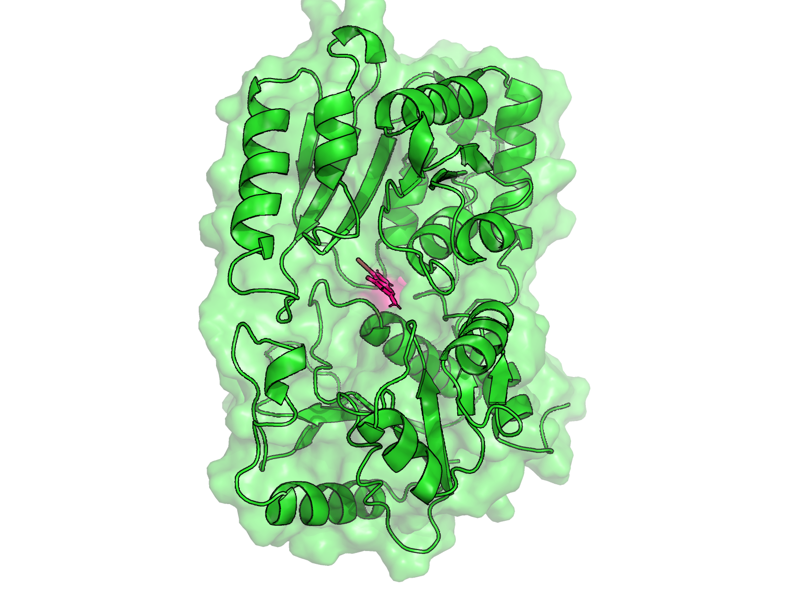

# 🧬 EquilibraTor

EquilibraTor is a Python-based command-line tool that automates the setup and execution of molecular dynamics (MD) simulations for protein (and optionally ligand) systems using GROMACS. The pipeline runs from topology generation to energy minimization and equilibration, with customizable execution steps.

## 🛠️  Installation

### ✅ Prerequisites

Ensure you have the following installed:

- Python 3.8+
- pip (Python package installer)
- Git
- Numpy
- Matplotlib
- GROMACS
- Open Babel
- ACPYPE
---
### Option 1:

```bash
pip install EquilibraTor
```

### Option 2:

Clone this repository to your local machine:

```bash
git clone https://github.com/Dias-Lab/EquilibraTor.git
cd EquilibraTor
```

---

## 🚀 Overview


- **Protein PDB Preprocessing** — ⬛ 

- **Ligand PDB Preprocessing** *(Optional)* — ⬜ 

- **GROMACS Preprocessing** — 🟦 

- **Energy Minimization & Equilibration** — 🟧 

- **EquilibraTor Outputs** — 🟩 

---

## ⚙️ Usage

If installed via `pip`, use only `equilibrator ...` otherwise `python EquilibraTor.py ...`

To show EquilibraTor arguments:

```text
python EquilibraTor.py -h
```

```
usage: EquilibraTor.py [-h] [-l LIGAND] -p PROTEIN [-fs FIRST_STEP] [-ls LAST_STEP] [-as]

   ____          _ ___ __           ______        
  / __/__ ___ __(_) (_) /  _______ /_  __/__  ____
 / _// _ `/ // / / / / _ \/ __/ _ `// / / _ \/ __/
/___/\_, /\_,_/_/_/_/_.__/_/  \_,_//_/  \___/_/
      /_/
Equilibrator streamlines Molecular dynamics and equilibration simulations for proteins and protein-ligand complexes in a single execution
Developers: José D. D. Cediel-Becerra, Jose Cleydson F. Silva and Raquel Dias
Afiliation: Microbiology & Cell Science Deparment, University of Florida
If you find any issues, please add a new issue in our GitHub repo (https://github.com/Dias-Lab/EquilibraTor)
Version:v0.0.1

options:
  -h, --help            show this help message and exit
  -l LIGAND, --ligand LIGAND
                        Path to the ligand file.
  -p PROTEIN, --protein PROTEIN
                        Path to the protein file.
  -fs FIRST_STEP, --first_step FIRST_STEP
                        Step number to start Equilibratior from (1-based)
  -ls LAST_STEP, --last_step LAST_STEP
                        Step number to end at (1-based)
  -as, --all_steps      List of Equilibrator steps and exit
```

## 📌 Note

- Only the protein file is required as input. 
- When the ligand is a polypeptide or another protein, it must be combined with the main protein into a single PDB file and provided using the -p option.
- Default .mdp files (ions.mdp, minim.mdp, equilibration.mdp, equilibration_2.mdp) are in equilibrator/flat. Modify them directly to change parameters.


To show the EquilibraTor steps to be performed for a protein file:

```Text
python EquilibraTor.py -p example_protein.pdb -as

Available steps:
1: Generate topology for protein
2: Prepare to merge topology file(s) if ligand provided
3: Create the simulation box
4: Solvate the system
5: Add ions to neutralize the system
6: Run energy minimization
7: Plot potential energy
8: Obtain potential, backbone, and pressure xvgs
9: Plot panel of additional energy minimization results
10: Get final minimized pdb structure
11: Run NVT equilibration
12: Get NVT equilibration output
13: Run NPT equilibration
14: Get NPT equilibration output
```
To run EquilibraTor for a protein file:

```Text
python EquilibraTor.py -p example_protein.pdb
````

If you want to tweak certain parameters for your current protein file and avoid running the entire Equilibrator workflow, you can specify only the steps you wish to execute:

```Text
python EquilibraTor.py -p example_protein.pdb -fs 10 -ls 14
```

To show the EquilibraTor steps to be performed when provided both protein and ligand files:

```Text
python EquilibraTor.py -l example_ligand.pdb -p example_protein.pdb -as

Available steps:
1: Generate topology for protein
2: Convert ligand PDB to MOL2
3: Generate topology for ligand
4: Prepare to merge topology file(s) if ligand provided
5: Make a copy of protein if ligand provided
6: Merge topologies
7: Create the simulation box
8: Solvate the system
9: Add ions to neutralize the system
10: Run energy minimization
11: Plot potential energy
12: Obtain potential, backbone, and pressure xvgs
13: Plot panel of additional energy minimization results
14: Get final minimized pdb structure
15: Run NVT equilibration
16: Get NVT equilibration output
17: Run NPT equilibration
18: Get NPT equilibration output
```

To run EquilibraTor using this protein-ligand files:

```Text
python EquilibraTor.py -l example_ligand.pdb -p example_protein.pdb
```


## 💾 Outputs

### Multiple panel figure


### Equilibration PDB last frame

