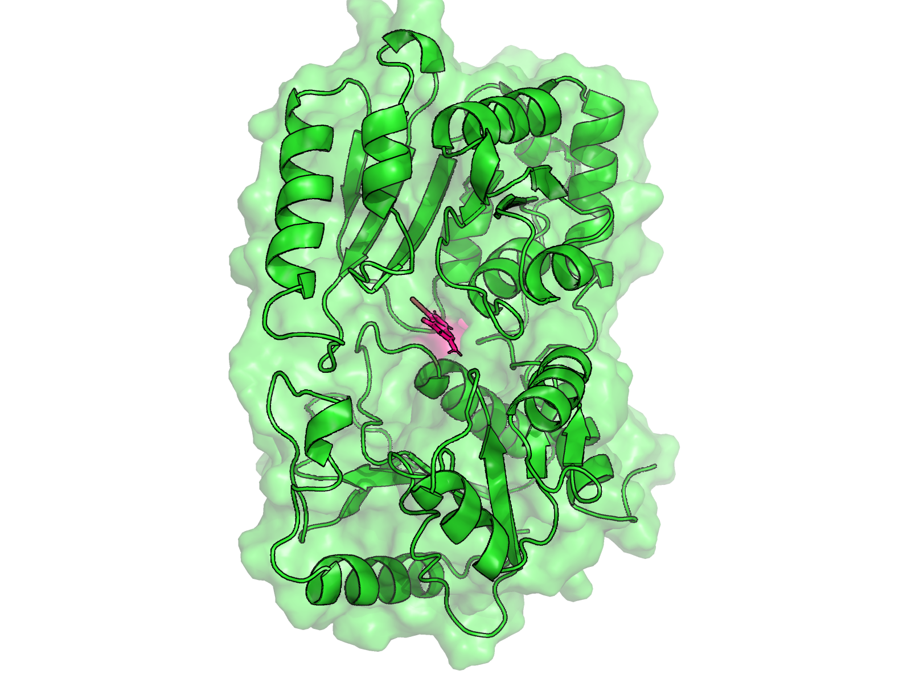

# Summary
EquilibraTor is a Python-based pipeline that simplifies the setup and execution of molecular dynamics (MD) simulations, including energy minimization and equilibration, for proteins, protein-protein interactions, and protein–ligand complexes. EquilibraTor automates preprocessing, topology generation, solvation, ion neutralization, and multiple stages of equilibration (i.e., simulations with controlled volume [NVT] and controlled pressure [NPT]) within a single execution step. Additionally, it supports ligand integration workflows and generates both simulation-ready files and informative plots summarizing key simulation metrics over time and residue position (e.g., root-mean-square deviation [RMSD], root-mean-square fluctuation [RMSF], energy, pressure, and radius of gyration). The pipeline is particularly useful for researchers in structural biology, computational biochemistry, and drug discovery, providing a fast, reproducible, and modular framework for standard MD preparation protocols. Its architecture is suitable for high-throughput workflows and local use on academic clusters or personal machines.

# Statement of need
MD simulations are foundational in structural biology and drug discovery, providing atomistic insights into the dynamic behavior of biomolecular systems over time [@bera:2019][@salo:2020]. They are widely used to study processes such as protein folding, conformational flexibility, ligand binding, and the structural basis of molecular recognition [@grasso:2023][@padhi:2022][@singh:2022]. By simulating the physical movements of atoms and molecules, MD enables researchers to explore functional mechanisms that are often inaccessible through experimental techniques [@dror:2012][@karplus:2002]. In drug discovery, MD plays a critical role in refining ligand poses, estimating binding affinities, and identifying allosteric sites [@hollingsworth:2018]. However, setting up MD simulations—particularly for protein–ligand systems—remains a labor-intensive and error-prone process.

Traditional workflows require multiple manual steps: preprocessing of Protein Data Bank (PDB) files [@burley:2025], protein and ligand topology generation, topology merging, solvation, neutralization, energy minimization, and multi-stage equilibration simulations. Each of these steps often involves different tools (e.g., ACPYPE [@sousa:2012], Open Babel [@o:2011], GROMACS [@berendsen:1995]), inconsistent file formats, repeated command-line operations, and manual file tracking. This fragmented and complex setup process not only demands expert knowledge but also hampers the accessibility, efficiency, and reproducibility of MD simulations. Despite the growing need for such tools, a comprehensive solution for automating this workflow in Python remains unavailable. Here, we present EquilibraTor, developed to address this gap.

# Implementation

EquilibraTor streamlines the complex and fragmented setup process of MD simulations by providing an automated, end-to-end pipeline for preparing and equilibrating proteins, protein-protein, and protein–ligand complexes. By unifying these steps into a single reproducible workflow, it reduces setup overhead and lets researchers focus on their scientific questions rather than technical preprocessing. The implementation prioritizes clarity and reproducibility, requiring minimal user intervention beyond supplying the initial input files (\autoref{fig:workflow}).

**Figure 1. EquilibraTor workflow for MD and equilibration simulations.** The pipeline begins with the specification and preprocessing of input files: a required protein PDB file (black boxes) and an optional ligand PDB file (grey boxes). In the GROMACS preprocessing stage (blue boxes), EquilibraTor builds the simulation box, solvates the system, and adds ions for charge neutralization. It then performs energy minimization and two-stage equilibration (orange boxes). Energy minimization and NVT/NPT equilibration steps use default .mdp parameter files included with EquilibraTor—IONS_MDP, MINIM_MDP, EQUILIBRATION_MDP, and EQUILIBRATION_2_MDP—which users can customize as needed. As outputs (green boxes), EquilibraTor generates a publication-ready multi-panel figure showing key simulation metrics (potential energy, pressure, temperature, RMSD, RMSF, and radius of gyration) and exports both the final frame as a PDB file and a movie of the full simulation trajectory.

To address the common challenges in MD simulation preparation, EquilibraTor provides these features:

- **Automation of Complex Workflows**:  
  EquilibraTor streamlines the entire MD setup—from initial preprocessing of input files to equilibrated systems—eliminating dozens of manual steps and repeated command-line operations, thus accelerating simulation preparation.

- **Integrated Ligand Support**:  
  Automatically handles ligand PDB-to-MOL2 conversion, topology generation (via ACPYPE), and merging with protein topologies––a process that typically requires extensive manual formatting, careful management of file types and naming conventions, and coordination between multiple tools with different input/output requirements.

- **Robust GROMACS Workflow Integration**:  
  Seamlessly wraps all necessary GROMACS commands––including `gmx grompp`, `gmx mdrun`, `gmx solvate`, `gmx genion`––to perform solvation, ion addition, energy minimization, and two-stage equilibration. This integration provides user-friendly defaults and logging, reducing the burden of manual configuration and making the simulation setup more robust and reproducible.

- **Built-in Plotting for Key MD Simulation Metrics**:  
  Automatically generates clear, high-quality plots of key MD metrics––including RMSD, RMSF, temperature, pressure, energy, and radius of gyration over time––directly from GROMACS output files. Traditionally, users must manually extract these metrics using `gmx energy`, `gmx rms`, and related commands, often involving scripted echo commands. The resulting `.xvg` files then require custom Python scripts to parse and convert the data (e.g., to NumPy arrays) for plotting. EquilibraTor streamlines those steps by directly parsing GROMACS outputs and producing ready-to-use plots with no additional coding or post-processing.

- **End-of-Simulation Frame and Trajectory Export for MD**:  
  Automatically extracts and saves the last frame of the MD simulation as a PDB file and exports the full trajectory as a movie, providing immediate visual outputs for analysis and presentation. EquilibraTor dynamically calculates the index of the last frame from the trajectory file, ensuring accurate capture of the simulation endpoint without requiring hardcoded frame numbers. This eliminates guesswork and manual inspection, streamlining downstream visualization and structural analysis.

- **Customizable and Restorable Pipeline Execution**:  
  Users can specify which steps of the pipeline to run, allowing for flexible use and efficient restarts without repeating previously completed tasks. This modularity also allows users to modify parameters between runs, facilitating iterative refinement of simulation setups and conditions.

- **Minimal Setup with Reproducibility of MD Simulations**:  
  Designed to work out-of-the-box with minimal configuration, EquilibraTor ensures that results are reproducible, well-organized, and easy to interpret.

# Outputs
As an example, we ran EquilibraTor using preQ0––a 7-deazapurine-derived scaffold with known bioactive properties [@cediel:2025][@de:2024]––as the ligand. The structure of preQ0 was obtained from the PubChem database (CID 135446206) [@kim:2025]. PreQ0 was paired with a glycosyltransferase (locus tag: KALB_4073) involved in the huimycin biosynthesis pathway (BGC0002354) from *Kutzneria albida* DSM 43870, in which preQ0 serves as the core natural product scaffold [@shuai:2020][@zdouc:2025].The 3D structure of the glycosyltransferase was modeled using AlphaFold3 [@abramson:2024]. MD simulations were performed on the best ligand pose obtained from prior molecular docking using AudoDock-GPU [@santos:2021]. The outputs from EquilibraTor include MD simulation metrics tracked over time and by residue (Figure 2), as well as the final frame of the MD trajectory exported in PDB format, which can be readily visualized using PyMol [@delano:2002] or related software (Figure 3)

**Figure 2. Multipanel figure summarizing key MD simulation metrics automatically generated by EquilibraTor.** Each panel displays a specific property over simulation time: potential energy, temperature, pressure, RMSD, and radius of gyration; and over residue position in the case of RMSF. These plots are created from GROMACS .xvg output files using built-in Python functions. For instance, EquilibraTor generates the potential energy plot by extracting data via gmx energy, parsing the resulting .edr file, and visualizing the data with matplotlib. All other metrics follow similar processing logic, enabling fully automated, publication-ready visualizations without requiring manual intervention.

**Figure 3. Last simulation frame of the glycosyltransferase–preQ0 complex generated by EquilibraTor and visualized in PyMOL.** This system corresponds to the final conformation obtained after energy minimization and equilibration, automatically extracted from the GROMACS trajectory.

# Acknowledgements

We thank the developers and communities behind GROMACS, ACPYPE and Open Babel for their continued support and comprehensive documentation, which have been essential to the development of EquilibraTor. We are also grateful to the members of Dr. Dias’s lab for thoroughly testing the tool and providing valuable feedback that helped refine its functionality.

# References
